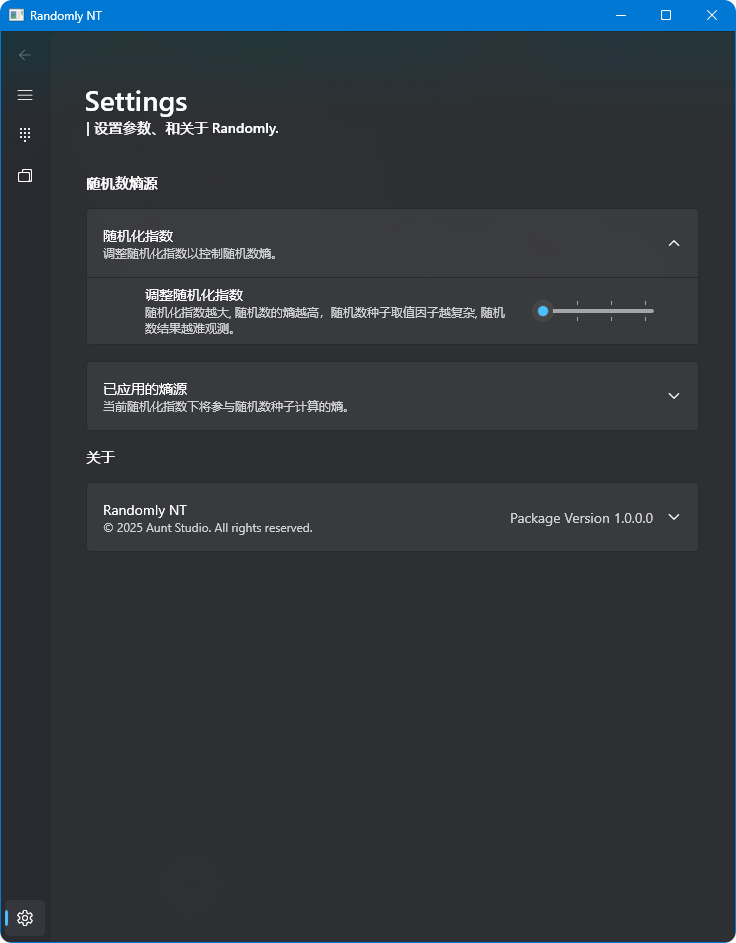

# ⚙️| 设置

<figure><figcaption></figcaption></figure>

## 随机化熵源设置

### 随机化因子调节

本程序提供了一个随机数因子来定量调节随机数种子熵源。有关随机数熵的更多信息，请参阅随机数熵。

调节该值，将应用不同数量和种类的随机数熵源。一般情况下，随机化因子越大，随机数越随机，随机数质量越高，生成结果越难预测。

### 已应用的随机数熵源

该控件展示了当前随机化因子数值下，将应用的随机数熵源。

<figure><figcaption>
随机化因子为4时应用的熵源
</figcaption></figure>

该部分熵源将通过某些运算，作为随机数种子的一部分，在每次计算随机数时影响随机数结果。


当应用真随机数接口时，抽取前将从 [Random.org](https://www.random.org/) 获得基于大气噪声计算的真随机数，因此需要连接网络并且每次抽取前需要一段时间来让程序从网络获取信息。


